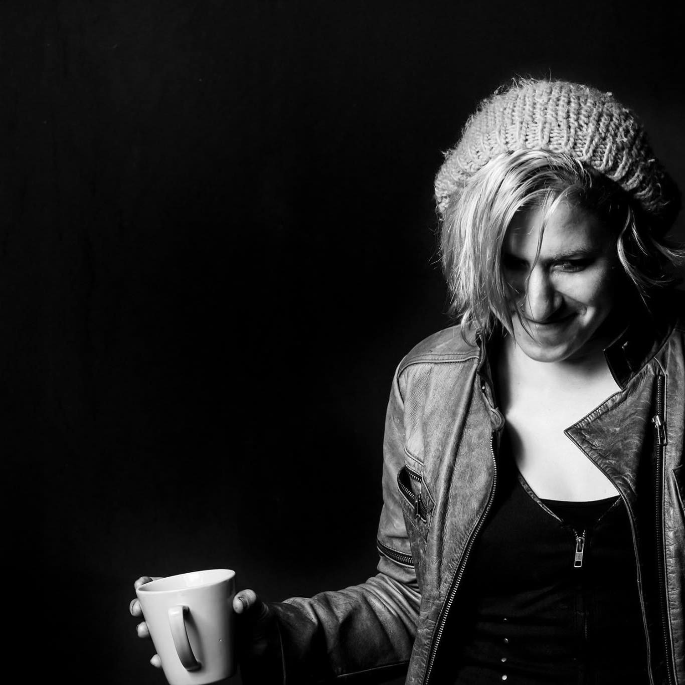

## About Nina

I was born and raised in Philadelphia — a city that doesn't let you be soft. I spent years in San Francisco, where the strange and the beautiful exist side by side, and for the last twelve years I've called the Pacific Northwest home.

I've been making art my whole life, but somewhere along the way it stopped being a hobby and started being the way I process being alive. My work lives in the tension between shadow and light, between what we hide and what we can't help but feel.

*We learn the most in our darkness. We grow most from our mistakes.*

That's not just something I say — it's the current that runs through everything I paint.

- - -

## Artist Statement

My mission as an artist is to awaken fearlessness, depth, compassion, and transformation through art. I create work that invites people to confront themselves honestly — to face their fears directly rather than run from them — because it is through this confrontation that we grow, heal, and become whole.

My art explores the human condition through a spiritual, philosophical, and deeply emotional lens. Through mythological figures, goddesses, dreamlike symbolism, and surreal worlds, I reflect the paradoxes within us all: light and dark, masculine and feminine, anima and animus, destruction and rebirth, love and grief. I am drawn to the hidden, the shadowed, and the wounded parts of the self, but also to the beauty that can emerge through integration.

I believe healing happens when opposites are acknowledged rather than denied. For every dark painting, I seek the light that exists beside it. For every broken heart, I search for the possibility of transformation, compassion, forgiveness, and renewal. My work is about transmutation — turning pain into wisdom, vulnerability into strength, and experience into meaning.

I aim to take viewers beyond the surface and into deeper emotional and psychological layers. Beauty, to me, is not perfection. Beauty is ripening through experience, self-awareness, resilience, and inner truth. We learn the most about ourselves through struggle, and when we are willing to understand our weaknesses, those weaknesses can become sources of power.

Through my work, I share my own journey so others may feel seen within theirs. I want my art to remind people that they are capable of evolution, passion, depth, and self-reclamation. I want to leave people more fearless than before — more willing to love deeply, embrace complexity, confront their shadows, drop the mask that weighs them down and keeps them trapped, and transform their pain into something alive, meaningful, and beautiful.

- - -

Follow my process on [Instagram](https://www.instagram.com/nintron) or reach out on [Facebook](https://www.facebook.com/nintron).
